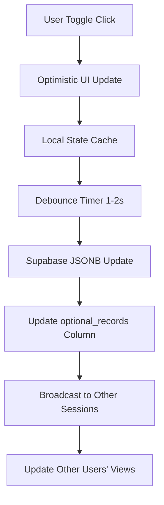
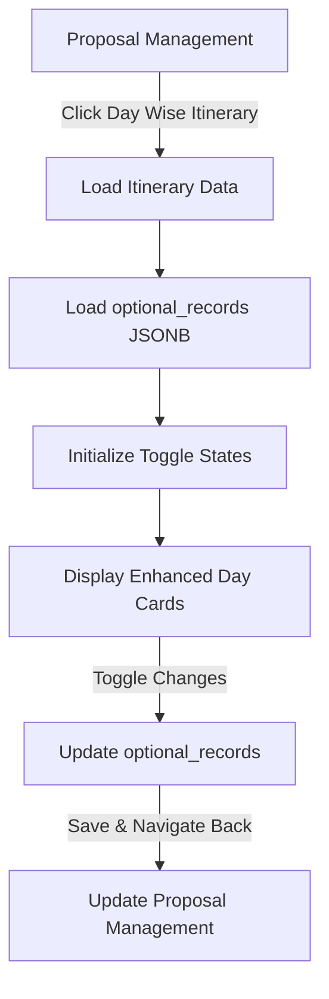

# Optional Toggle Feature - Product Requirements Document

## 1. Product Overview

The Optional Toggle feature enhances the Day Wise Itinerary module by allowing users to mark sightseeing and transport activities as either "Included" or "Optional" in travel proposals. This provides flexibility in proposal customization, enabling travel agents to offer tiered pricing and personalized experiences for their clients.

The feature leverages the existing `optional_records` JSONB column in the `public.proposals` table to persist optional states, ensuring seamless integration with the current proposal management system.

## 2. Core Features

### 2.1 User Roles
| Role | Registration Method | Core Permissions |
|------|---------------------|------------------|
| Travel Agent | Email registration | Create, edit, and manage proposals with optional toggles |
| Admin | Invitation-based | Full proposal management and system configuration |
| Client | Guest access | View proposals with optional items clearly marked |

### 2.2 Feature Module
The Day Wise Itinerary optional toggle feature consists of the following main components:

1. **Day Wise Itinerary Page**: Enhanced itinerary builder with toggle switches for each activity and transport item
2. **Proposal Management Page**: Overview of all optional items with bulk management capabilities
3. **Proposal Preview Page**: Client-facing view showing optional items in a dedicated section
4. **Real-time Sync Module**: Automatic persistence of toggle states to Supabase

### 2.3 Page Details

| Page Name | Module Name | Feature Description |
|-----------|-------------|---------------------|
| Day Wise Itinerary | Activity Cards | Toggle switch beside each sightseeing activity to mark as optional/included |
| Day Wise Itinerary | Transport Cards | Toggle switch beside each transport item to mark as optional/included |
| Day Wise Itinerary | Meals Section | Enhanced meal options with breakfast/lunch/dinner toggles |
| Day Wise Itinerary | Real-time Status | Show "Saving..." and "Saved" feedback during toggle operations |
| Proposal Management | Optional Items Summary | Display all optional activities and transport in organized list |
| Proposal Preview | Optional Add-ons Section | Separate section highlighting optional items with pricing |
| Proposal Preview | Inline Editing | Allow optional status changes directly in preview mode |

## 3. Core Process

### User Flow: Marking Items as Optional
1. User navigates to Day Wise Itinerary tab in proposal creation
2. User clicks toggle switch next to any sightseeing or transport item
3. System immediately updates UI with visual feedback (opacity change, optional badge)
4. System debounces update (1-2 seconds) and saves to Supabase `optional_records` JSONB
5. User sees real-time confirmation with timestamp of last update
6. Changes persist across tab switches and session refreshes

### Data Synchronization Flow


### Module Navigation Flow


## 4. User Interface Design

### 4.1 Design Style
- **Primary Colors**: Purple theme (#8B5CF6) for included items, Orange (#F59E0B) for optional items
- **Toggle Switch**: Modern iOS-style switch with smooth animation
- **Button Style**: Rounded corners with subtle shadows and hover effects
- **Typography**: Inter font family, 14px base size for toggle labels
- **Layout**: Card-based design with clear visual hierarchy
- **Icons**: Lucide React icons for consistency (Settings for optional, CheckCircle for included)

### 4.2 Page Design Overview

| Page Name | Module Name | UI Elements |
|-----------|-------------|-------------|
| Day Wise Itinerary | Activity Card | Purple border, activity icon, duration badge, cost display, toggle switch positioned top-right |
| Day Wise Itinerary | Transport Card | Blue border, vehicle icon, route info, price tag, toggle switch aligned with activity cards |
| Day Wise Itinerary | Optional Toggle | Small switch (scale-75), color-coded labels, animated transitions, loading spinner overlay |
| Day Wise Itinerary | Meals Section | Grid layout with breakfast/lunch/dinner checkboxes, emoji icons, compact design |
| Proposal Preview | Optional Section | Light background, italic text, "Optional Add-ons" header, grouped by day |

### 4.3 Responsiveness
- **Desktop-first**: Full-featured interface with all toggle controls visible
- **Mobile-adaptive**: Collapsible cards, larger touch targets for toggles
- **Tablet optimization**: Two-column layout for better space utilization
- **Touch interaction**: 44px minimum touch target size for all interactive elements

## 5. Technical Specifications

### 5.1 Data Structure
The `optional_records` JSONB column stores optional states in the following format:

```json
{
  "days": [
    {
      "day_number": 1,
      "sightseeing": [
        {
          "id": "act_001",
          "name": "Phi Phi Island Tour",
          "is_optional": false,
          "updatedAt": "2024-01-15T10:30:00Z",
          "updatedBy": "user_123"
        }
      ],
      "transport": [
        {
          "id": "tr_001",
          "name": "Airport Transfer",
          "is_optional": true,
          "updatedAt": "2024-01-15T10:35:00Z",
          "updatedBy": "user_123"
        }
      ]
    }
  ]
}
```

### 5.2 Performance Requirements
- **Toggle Response**: UI update within 100ms of user interaction
- **Save Operation**: Supabase update completion within 2 seconds
- **Data Loading**: Optional states load with itinerary data, no additional API calls
- **Debouncing**: 1-2 second delay before Supabase updates to prevent excessive writes
- **Error Recovery**: Automatic retry on failed updates, user notification after 3 attempts

### 5.3 Error Handling
- **Network Failures**: Queue updates locally, sync when connection restored
- **Validation Errors**: Clear user feedback with specific error messages
- **Concurrent Updates**: Last-write-wins with timestamp-based conflict resolution
- **Data Corruption**: Fallback to default included state if optional_records is malformed

## 6. Success Metrics

### User Experience Metrics
- **Toggle Usage Rate**: Percentage of proposals with at least one optional item
- **Save Success Rate**: Percentage of successful Supabase updates
- **User Engagement**: Average number of optional toggles used per proposal
- **Error Rate**: Number of failed updates per 100 toggle interactions

### Performance Metrics
- **Response Time**: Average time from toggle click to UI update (<100ms)
- **Sync Time**: Average time for Supabase update completion (<2s)
- **Data Consistency**: Percentage of proposals with correctly synced optional states
- **Mobile Performance**: Touch response time on mobile devices (<150ms)

## 7. Future Enhancements

### Phase 2 Features
- **Bulk Operations**: Select multiple items and toggle optional status in batch
- **Pricing Rules**: Automatic price calculations based on optional selections
- **Client Preferences**: Save client optional preferences for future proposals
- **Export Options**: PDF generation with optional items in separate section

### Advanced Functionality
- **Conditional Logic**: Show/hide optional items based on client selections
- **Package Deals**: Group optional items into upgrade packages
- **Inventory Integration**: Real-time availability checking for optional activities
- **Analytics Dashboard**: Track which optional items are most frequently selected