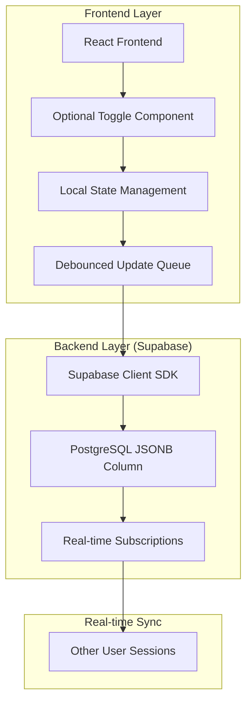
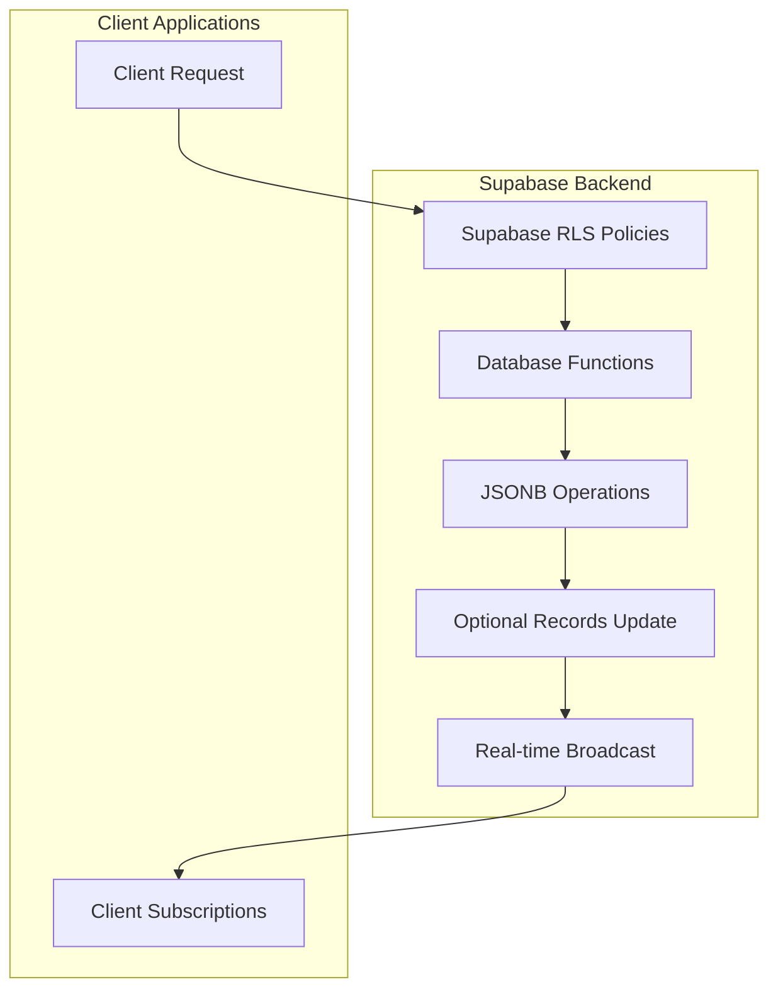
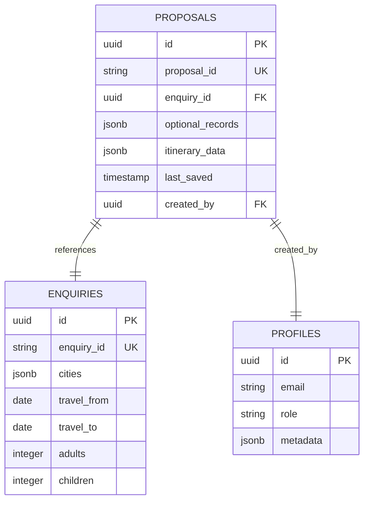

# Optional Toggle Feature - Technical Architecture Document

## 1. Architecture Design



## 2. Technology Description

### Frontend Stack
- **Framework**: React@18 with TypeScript
- **UI Components**: TailwindCSS@3 + shadcn/ui components
- **State Management**: React hooks with custom debouncing logic
- **Real-time Updates**: Supabase real-time subscriptions
- **Build Tool**: Vite with hot module replacement

### Backend Infrastructure
- **Database**: Supabase PostgreSQL with JSONB support
- **Authentication**: Supabase Auth with RLS policies
- **Real-time**: Supabase Realtime for live data synchronization
- **Storage**: Supabase Storage for file attachments

### Key Dependencies
```json
{
  "@supabase/supabase-js": "^2.38.0",
  "react": "^18.2.0",
  "typescript": "^5.0.0",
  "tailwindcss": "^3.3.0",
  "lucide-react": "^0.294.0"
}
```

## 3. Route Definitions

| Route | Purpose | Components |
|-------|---------|------------|
| `/queries/advanced-proposal/:id` | Main proposal creation interface | AdvancedProposalCreation, EnhancedDayPlanningInterface |
| `/queries/advanced-proposal/:id?tab=itinerary` | Day Wise Itinerary view | DayByDayItineraryBuilder, EnhancedDayCard |
| `/queries/advanced-proposal/:id?tab=proposal` | Proposal Management view | ComprehensiveProposalManager |
| `/proposals/preview/:id` | Client proposal preview | ProposalPreview with optional items section |

## 4. API Definitions

### 4.1 Core API Endpoints

#### Update Optional Records
```
PATCH /api/proposals/:id/optional-records
```

**Request Body:**
```typescript
interface UpdateOptionalRecordsRequest {
  itemId: string;
  itemType: 'activity' | 'transport';
  isOptional: boolean;
  dayNumber?: number;
  updatePath?: string[];
}
```

**Response:**
```typescript
interface UpdateOptionalRecordsResponse {
  success: boolean;
  data: {
    optional_records: OptionalRecords;
    last_saved: string;
  };
  error?: string;
}
```

#### Get Proposal with Optional Records
```
GET /api/proposals/:id
```

**Response:**
```typescript
interface ProposalResponse {
  id: string;
  proposal_id: string;
  enquiry_id: string;
  optional_records: OptionalRecords;
  itinerary_data: ItineraryDay[];
  last_saved: string;
}
```

### 4.2 TypeScript Interfaces

```typescript
// Core optional records structure
interface OptionalRecords {
  days?: DayOptionalRecord[];
  cities?: CityOptionalRecord[];
  sightseeing?: ComponentOptionalRecord[];
  transport?: ComponentOptionalRecord[];
}

interface DayOptionalRecord {
  day_number: number;
  sightseeing: ActivityOptionalRecord[];
  transport: TransportOptionalRecord[];
}

interface ActivityOptionalRecord {
  id: string;
  name: string;
  is_optional: boolean;
  updatedAt: string;
  updatedBy: string;
}

interface TransportOptionalRecord {
  id: string;
  name: string;
  is_optional: boolean;
  updatedAt: string;
  updatedBy: string;
}

interface ComponentOptionalRecord {
  optionId: string;
  isOptional: boolean;
  updatedAt: string;
  updatedBy: string;
  cost?: number;
  description?: string;
}

// Toggle component props
interface OptionalToggleProps {
  isOptional: boolean;
  onToggle: (isOptional: boolean) => void;
  size?: 'sm' | 'md' | 'lg';
  showLabels?: boolean;
  className?: string;
  disabled?: boolean;
}

interface RealTimeToggleProps extends OptionalToggleProps {
  itemId: string;
  itemType: 'activity' | 'transport';
  proposalId: string;
  onRealTimeUpdate?: (itemId: string, itemType: 'activity' | 'transport', isOptional: boolean) => Promise<void>;
  isLoading?: boolean;
}
```

## 5. Server Architecture Diagram



## 6. Data Model

### 6.1 Database Schema



### 6.2 Data Definition Language

#### Proposals Table with Optional Records
```sql
-- Create proposals table with optional_records JSONB column
CREATE TABLE public.proposals (
    id UUID PRIMARY KEY DEFAULT gen_random_uuid(),
    proposal_id TEXT UNIQUE NOT NULL,
    enquiry_id UUID REFERENCES public.enquiries(id) ON DELETE CASCADE,
    draft_type TEXT DEFAULT 'enhanced',
    status TEXT DEFAULT 'draft',
    itinerary_data JSONB DEFAULT '[]'::jsonb,
    optional_records JSONB DEFAULT '{}'::jsonb,
    pricing_data JSONB DEFAULT '{}'::jsonb,
    last_saved TIMESTAMP WITH TIME ZONE DEFAULT NOW(),
    created_by UUID REFERENCES public.profiles(id) ON DELETE SET NULL,
    created_at TIMESTAMP WITH TIME ZONE DEFAULT NOW(),
    updated_at TIMESTAMP WITH TIME ZONE DEFAULT NOW()
);

-- Create GIN index for JSONB queries
CREATE INDEX idx_proposals_optional_records 
ON public.proposals USING gin (optional_records jsonb_path_ops);

-- Create index for last_saved queries
CREATE INDEX idx_proposals_last_saved 
ON public.proposals USING btree (last_saved DESC);
```

#### Row Level Security (RLS) Policies
```sql
-- Enable RLS
ALTER TABLE public.proposals ENABLE ROW LEVEL SECURITY;

-- Allow authenticated users to read their own proposals
CREATE POLICY "Users can view own proposals" ON public.proposals
    FOR SELECT USING (
        created_by = auth.uid() OR 
        EXISTS (
            SELECT 1 FROM public.enquiries 
            WHERE enquiries.id = proposals.enquiry_id 
            AND enquiries.agent_id = auth.uid()
        )
    );

-- Allow authenticated users to update their own proposals
CREATE POLICY "Users can update own proposals" ON public.proposals
    FOR UPDATE USING (
        created_by = auth.uid() OR
        EXISTS (
            SELECT 1 FROM public.enquiries 
            WHERE enquiries.id = proposals.enquiry_id 
            AND enquiries.agent_id = auth.uid()
        )
    );
```

#### Database Functions for JSONB Updates
```sql
-- Function to update specific item in optional_records
CREATE OR REPLACE FUNCTION update_optional_item(
    proposal_id UUID,
    item_type TEXT,
    item_id TEXT,
    is_optional BOOLEAN,
    user_id UUID
)
RETURNS BOOLEAN AS $$
BEGIN
    UPDATE public.proposals
    SET 
        optional_records = jsonb_set(
            COALESCE(optional_records, '{}'::jsonb),
            ARRAY[item_type, item_id, 'is_optional'],
            to_jsonb(is_optional),
            true
        ),
        optional_records = jsonb_set(
            COALESCE(optional_records, '{}'::jsonb),
            ARRAY[item_type, item_id, 'updatedAt'],
            to_jsonb(NOW()::text),
            true
        ),
        optional_records = jsonb_set(
            COALESCE(optional_records, '{}'::jsonb),
            ARRAY[item_type, item_id, 'updatedBy'],
            to_jsonb(user_id::text),
            true
        ),
        last_saved = NOW()
    WHERE id = proposal_id;
    
    RETURN FOUND;
END;
$$ LANGUAGE plpgsql SECURITY DEFINER;
```

## 7. Implementation Components

### 7.1 Core React Components

#### OptionalToggle Component
```typescript
// src/components/proposal/itinerary/OptionalToggle.tsx
export const OptionalToggle: React.FC<OptionalToggleProps> = ({
  isOptional,
  onToggle,
  size = 'sm',
  showLabels = true,
  className,
  disabled = false
}) => {
  const sizeClasses = {
    sm: 'scale-75',
    md: 'scale-90',
    lg: 'scale-100'
  };

  return (
    <div className={cn("flex items-center gap-2 transition-all duration-200", className)}>
      <Switch
        checked={!isOptional}
        onCheckedChange={(checked) => onToggle(!checked)}
        className={sizeClasses[size]}
        disabled={disabled}
      />
      {showLabels && (
        <div className="flex items-center gap-1">
          {isOptional ? (
            <>
              <Settings className="h-3 w-3 text-orange-500" />
              <Badge variant="outline" className="text-xs bg-orange-50 dark:bg-orange-900/30 text-orange-700 dark:text-orange-300">
                Optional
              </Badge>
            </>
          ) : (
            <>
              <CheckCircle className="h-3 w-3 text-green-500" />
              <Badge variant="outline" className="text-xs bg-green-50 dark:bg-green-900/30 text-green-700 dark:text-green-300">
                Included
              </Badge>
            </>
          )}
        </div>
      )}
    </div>
  );
};
```

#### RealTimeOptionalToggle Component
```typescript
// Enhanced with debouncing and error handling
export const RealTimeOptionalToggle: React.FC<RealTimeToggleProps> = ({
  itemId,
  itemType,
  proposalId,
  isOptional,
  onToggle,
  onRealTimeUpdate,
  isLoading = false,
  disabled = false,
  ...props
}) => {
  const [isUpdating, setIsUpdating] = useState(false);
  const [lastUpdated, setLastUpdated] = useState<Date | null>(null);
  const { user } = useAuth();
  const debounceTimeout = useRef<NodeJS.Timeout>();

  const handleToggle = async (newOptionalState: boolean) => {
    // Optimistic update
    onToggle(newOptionalState);
    
    // Clear existing timeout
    if (debounceTimeout.current) {
      clearTimeout(debounceTimeout.current);
    }

    // Debounce the API call
    debounceTimeout.current = setTimeout(async () => {
      setIsUpdating(true);
      try {
        if (onRealTimeUpdate) {
          await onRealTimeUpdate(itemId, itemType, newOptionalState);
        } else {
          await updateOptionalRecordsInDB(newOptionalState);
        }
        setLastUpdated(new Date());
      } catch (error) {
        console.error('Failed to update optional status:', error);
        // Revert on error
        onToggle(!newOptionalState);
      } finally {
        setIsUpdating(false);
      }
    }, 1000); // 1 second debounce
  };

  return (
    <div className="relative">
      <OptionalToggle
        {...props}
        isOptional={isOptional}
        onToggle={handleToggle}
        disabled={isLoading || isUpdating || disabled}
      />
      {isUpdating && (
        <div className="absolute -top-1 -right-1">
          <Loader2 className="h-3 w-3 text-blue-500 animate-spin" />
        </div>
      )}
    </div>
  );
};
```

### 7.2 Supabase Integration

#### Optional Records Service
```typescript
// src/services/optionalRecordsService.ts
export class OptionalRecordsService {
  static async updateOptionalItem(
    proposalId: string,
    itemType: 'activity' | 'transport',
    itemId: string,
    isOptional: boolean,
    userId: string
  ): Promise<boolean> {
    try {
      // Get current optional_records
      const { data: proposalData, error: fetchError } = await supabase
        .from('proposals')
        .select('optional_records')
        .eq('id', proposalId)
        .single();

      if (fetchError) throw fetchError;

      // Update the specific item
      const currentOptionalRecords = proposalData?.optional_records || {};
      const recordType = itemType === 'activity' ? 'sightseeing' : 'transport';
      
      // Initialize structure if needed
      if (!currentOptionalRecords[recordType]) {
        currentOptionalRecords[recordType] = [];
      }

      // Find and update or create new record
      const existingIndex = currentOptionalRecords[recordType].findIndex(
        (record: any) => record.optionId === itemId
      );

      if (existingIndex >= 0) {
        currentOptionalRecords[recordType][existingIndex] = {
          ...currentOptionalRecords[recordType][existingIndex],
          isOptional,
          updatedAt: new Date().toISOString(),
          updatedBy: userId
        };
      } else {
        currentOptionalRecords[recordType].push({
          optionId: itemId,
          isOptional,
          updatedAt: new Date().toISOString(),
          updatedBy: userId
        });
      }

      // Update database
      const { error: updateError } = await supabase
        .from('proposals')
        .update({
          optional_records: currentOptionalRecords,
          last_saved: new Date().toISOString()
        })
        .eq('id', proposalId);

      if (updateError) throw updateError;

      return true;
    } catch (error) {
      console.error('Error updating optional records:', error);
      throw error;
    }
  }

  static getOptionalStatus(
    optionalRecords: OptionalRecords,
    itemType: 'activity' | 'transport',
    itemId: string
  ): boolean {
    const recordType = itemType === 'activity' ? 'sightseeing' : 'transport';
    const records = optionalRecords?.[recordType] || [];
    const record = records.find((r: any) => r.optionId === itemId);
    return record?.isOptional || false;
  }
}
```

## 8. Performance Optimization

### 8.1 Debouncing Strategy
- **Toggle Operations**: 1-second debounce before Supabase updates
- **Batch Updates**: Group multiple toggles within 2-second window
- **Local Queue**: Maintain pending operations queue for offline support

### 8.2 Caching Implementation
- **Local State Cache**: Store optional states in React state for immediate UI updates
- **Supabase Realtime**: Subscribe to proposal changes for multi-user synchronization
- **Selective Re-renders**: Use React.memo and useMemo to prevent unnecessary re-renders

### 8.3 Error Handling & Recovery
- **Optimistic Updates**: Update UI immediately, revert on failure
- **Retry Logic**: Automatic retry with exponential backoff for failed updates
- **Offline Support**: Queue updates locally, sync when connection restored
- **Conflict Resolution**: Timestamp-based last-write-wins approach

## 9. Security Considerations

### 9.1 Data Validation
- **Input Sanitization**: Validate all item IDs and types before database operations
- **Type Safety**: Strong TypeScript interfaces prevent runtime errors
- **JSON Schema Validation**: Validate optional_records structure on server side

### 9.2 Access Control
- **Row Level Security**: RLS policies ensure users can only modify their own proposals
- **Authentication**: All operations require authenticated user context
- **Audit Trail**: Track all optional status changes with user ID and timestamp

### 9.3 Data Integrity
- **Atomic Updates**: Use PostgreSQL transactions for complex updates
- **Backup Strategy**: Regular backups of proposals table with JSONB data
- **Migration Safety**: Backward-compatible schema changes only

## 10. Testing Strategy

### 10.1 Unit Tests
- **Component Testing**: Test toggle behavior and state management
- **Service Testing**: Mock Supabase operations for service layer tests
- **Utility Testing**: Test helper functions for optional records manipulation

### 10.2 Integration Tests
- **End-to-End Testing**: Full user flow from toggle click to database persistence
- **Real-time Testing**: Verify multi-user synchronization works correctly
- **Error Scenario Testing**: Test network failures and recovery mechanisms

### 10.3 Performance Testing
- **Load Testing**: Test system behavior with many concurrent toggles
- **Response Time Testing**: Ensure UI updates within 100ms target
- **Memory Testing**: Verify no memory leaks with frequent toggle operations